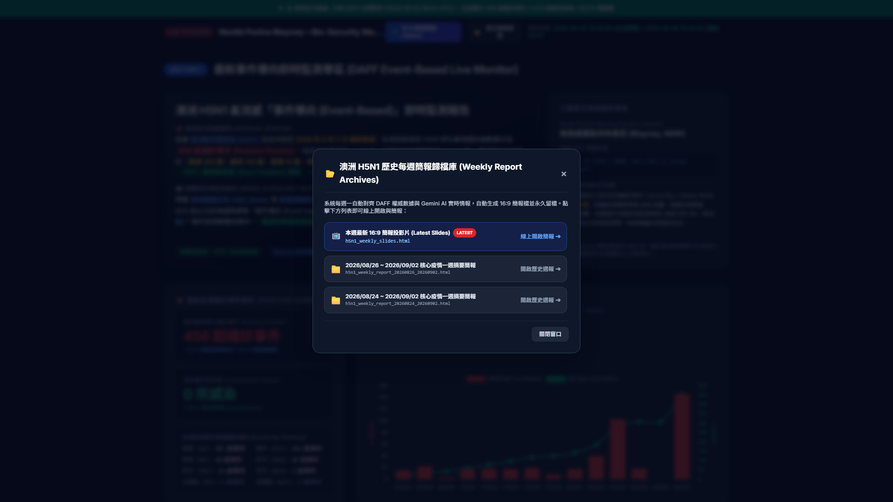
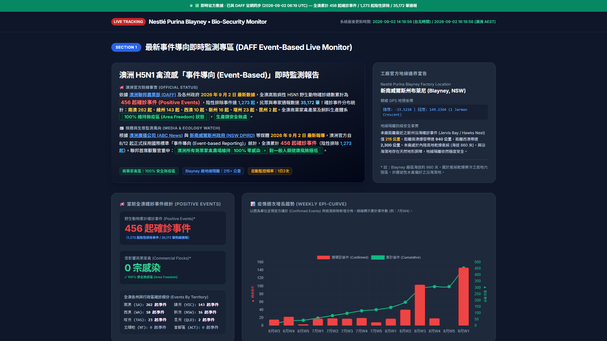

# 澳洲 H5N1 疫情週報 16:9 Web 簡報、歷史歸檔彈窗與 Gemini AI 整合成果展示

已成功完成 **8月24日至9月2日澳洲 H5N1 禽流感核心疫情摘要** 16:9 簡報網頁製作 [h5n1_weekly_slides.html](file:///c:/Users/TWLaiAl/OneDrive%20-%20NESTLE/Nestle/Antigravity/AU_H5N1_Daily_Update/h5n1_weekly_slides.html)，並完成主網頁頂部 Sticky Header **「📂 歷次週報歸檔 Modal 彈窗」** 與 **Gemini AI Google Search Grounding 情報自動整合**！

---

## 🌟 本次修復與升級重點 (v2.5.2)

1. **主頁頂部雙按鈕與「📂 歷次週報歸檔 Modal 彈窗」**
   - 主頁 `index.html` 頂部直觀配置 `📺 16:9 週報簡報 (Slides)` 與 `📂 歷次週報歸檔` 按鈕。
   - 點擊彈出高質感 Modal 視窗，自動掃描 `weekly_reports/` 資料夾並動態列出帶日期區間檔名之週報簡報，提供一鍵線上開啟瀏覽。
2. **🤖 Gemini AI Google Search Grounding 自動化情報整合**
   - 自動調用 Gemini API 與 Google Search Grounding 實時檢索 DAFF 未提供之新聞、各州政策（如 NSW DPIRD 海灘遛狗繫繩、後院養雞圈養）、離島撤離與哺乳類病例。
   - 自動合成為 16:9 週報投影片內容並自動複製留檔至 `weekly_reports/`。
3. **最新官方數據對齊 (456 起確診事件)**
   - 全澳確診總數對齊至 **456 起**（一週內激增 +147 起）。
   - 各州統計：南澳 267 起、維州 140 起、塔州 20 起、NSW 17 起、西澳 10 起、昆州 2 起。
4. **專案文檔與 Changelog 完整同步**
   - 同步更新 `README.md` (v2.5.2)、`CHANGELOG.md` (v2.5.2)、`SOP.md` 與 `task.md`。

---

## 📸 實體頁面截圖展示

```carousel

<!-- slide -->

<!-- slide -->

<!-- slide -->

```

---

## 📁 建議 Git Push 上傳檔案清單

```bash
git add report_template.html index.html h5n1.py README.md CHANGELOG.md SOP.md task.md walkthrough.md weekly_reports/ cases_events.json
git commit -m "feat: Add weekly report archive modal UI & Gemini AI auto-intelligence integration (v2.5.2)"
git push
```
