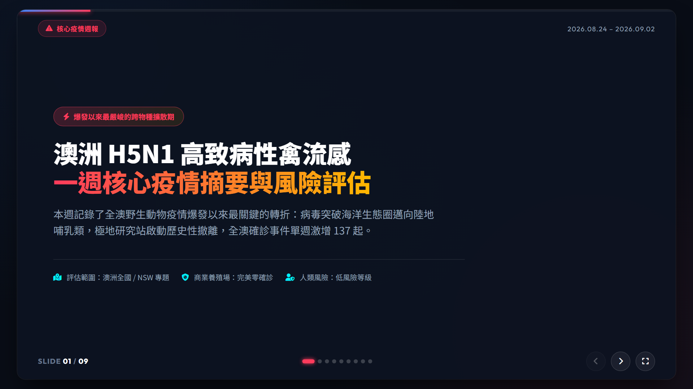
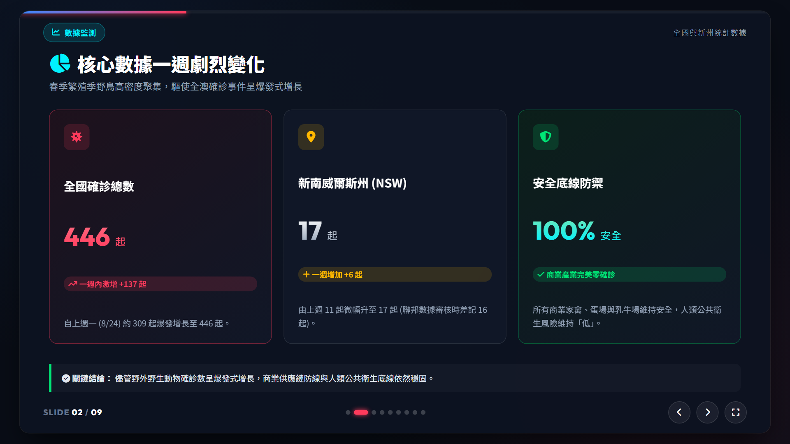
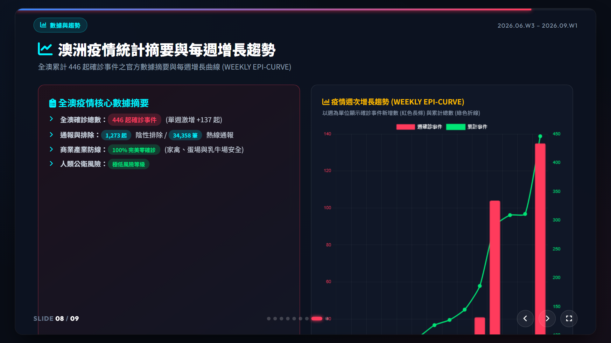
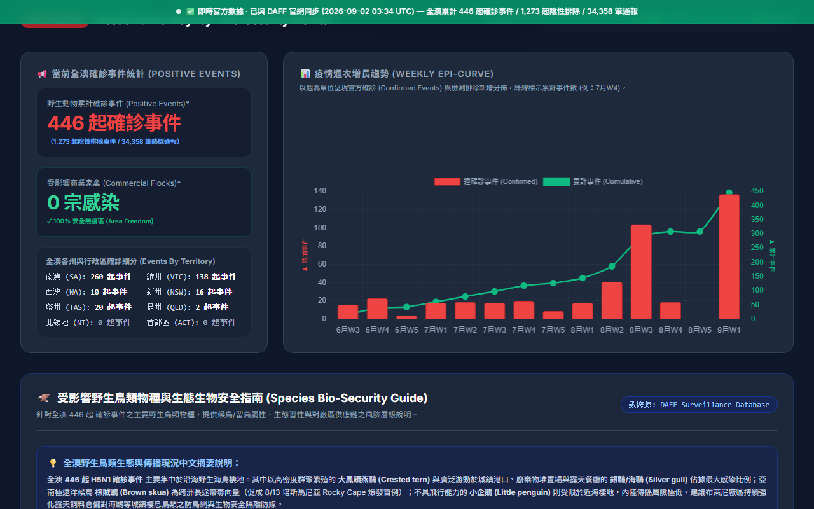

# 澳洲 H5N1 疫情週報 16:9 Web 簡報與系統修復成果展示

已成功完成 **8月24日至9月2日澳洲 H5N1 禽流感核心疫情摘要** 16:9 簡報網頁製作 [h5n1_weekly_slides.html](file:///c:/Users/TWLaiAl/OneDrive%20-%20NESTLE/Nestle/Antigravity/AU_H5N1_Daily_Update/h5n1_weekly_slides.html)，並完成 `index.html` 每週動態趨勢圖表時間軸修復。

---

## 🌟 本次修復與升級重點

1. **16:9 Web 簡報系統 (`h5n1_weekly_slides.html`)**
   - 包含 9 頁故事線，自適應 1080p/720p/全螢幕 16:9 視窗。
   - 支援鍵盤快速鍵操控：`←` / `→` / `Space` / `PageUp` / `PageDown` / `Home` / `End` / `F (全螢幕)`。
   - 第 8 頁特別規劃為 **左側全澳數據與各州細分摘要卡片 + 右側 16:9 互動式每週增長趨勢圖表 (Weekly Epi-Curve)**。
2. **長條圖週次時間軸延伸修復 (Weekly Epi-Curve Fix)**
   - 修復原本 `report_template.html` 與 `index.html` 標籤止於 `8月W2` 導致 8月W3、8月W4、8月W5 與 9月W1 數據無法呈現的問題。
   - 實作 `generateWeekLabels()` 動態時間軸解析器，完美涵蓋 **6 月 W3 至 9 月 W1 (2026.09.02 最新通報 446 起)**。
3. **專案文檔與 Changelog 完整同步**
   - 同步更新 `README.md`（含 v2.5 版本歷史記錄）、`CHANGELOG.md`、`SOP.md` 與 `task.md`。

---

## 📸 實體頁面截圖展示

````carousel

<!-- slide -->

<!-- slide -->

<!-- slide -->

````

---

## 📁 建議 Git Push 上傳檔案清單

```bash
git add README.md CHANGELOG.md SOP.md task.md walkthrough.md report_template.html index.html live_page.html live_page_utf8.html h5n1_weekly_slides.html cases_events.json
git commit -m "feat: Add 16:9 H5N1 weekly presentation deck (v2.5) & fix weekly epi-curve chart timeframe"
git push
```
